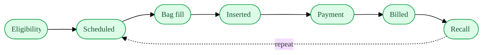
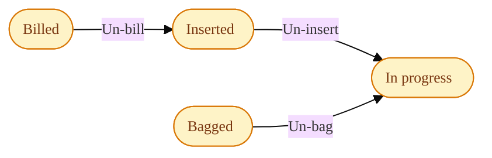
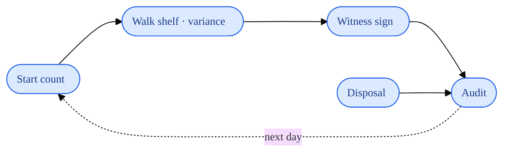

# Manual Mermaid Diagrams Implementation Plan

> **For agentic workers:** REQUIRED SUB-SKILL: Use superpowers:subagent-driven-development (recommended) or superpowers:executing-plans to implement this plan task-by-task. Steps use checkbox (`- [ ]`) syntax for tracking.

**Goal:** Render real Mermaid flowcharts in the in-app module manual (lazy-loaded), and convert the pellet `full-workflow` section from ASCII art to three focused, semantic-colored diagrams.

**Architecture:** `frontend/src/components/manual/ModuleManual.jsx` keeps rendering Markdown via `marked` + DOMPurify. A new `MarkdownBody` component wraps the rendered HTML and runs a `useMermaid` effect that lazy-imports `mermaid`, finds `code.language-mermaid` blocks, and replaces each with rendered SVG (falling back to the visible source on parse error). Both the published section and the editor Preview use `MarkdownBody`. The pellet `full-workflow` manual content (`backend/app/services/manual_seed.py`) becomes three ` ```mermaid ` blocks.

**Tech Stack:** React 18, Vite, `marked`, `dompurify`, `mermaid` (new), Tailwind; FastAPI + SQLAlchemy manual seed; Cloud Run deploy.

**Testing note:** No frontend test runner exists in this repo (`package.json` has no `test`/`vitest`/`jest`), and the spec excludes adding one. The `useMermaid` hook is React/DOM-bound (not a pure unit). Verification is therefore: `npm run build` clean, a render check in `npm run dev`, and a deliberate malformed-block check for the fallback. Backend content change is verified by the existing seed-import check + prod read-back.

---

### Task 1: Add the `mermaid` dependency

**Files:**
- Modify: `frontend/package.json`, `frontend/package-lock.json` (via npm)

- [ ] **Step 1: Install mermaid**

Run from the repo root:
```bash
cd /Users/wwcclaudecode/Documents/wwc-era-project/frontend && npm install mermaid
```
Expected: `package.json` gains a `"mermaid": "^11.x"` dependency; lockfile updates; no error.

- [ ] **Step 2: Verify the build is still clean (mermaid not yet imported)**

Run:
```bash
cd /Users/wwcclaudecode/Documents/wwc-era-project/frontend && npm run build 2>&1 | tail -3
```
Expected: `✓ built` with no errors. Bundle size unchanged (mermaid isn't imported yet — it's lazy).

- [ ] **Step 3: Commit**

```bash
cd /Users/wwcclaudecode/Documents/wwc-era-project
git add frontend/package.json frontend/package-lock.json
git commit -m "build(frontend): add mermaid dependency (lazy-loaded)"
```

---

### Task 2: Add `MarkdownBody` + `useMermaid` and wire both render sites

**Files:**
- Modify: `frontend/src/components/manual/ModuleManual.jsx`

Currently the file has two `dangerouslySetInnerHTML` render sites: the published section body (in `Section`, the `!editing` branch) and the editor Preview (`previewing` branch). Both call `renderMarkdown(...)` inline. This task introduces one component used by both.

- [ ] **Step 1: Add imports and the lazy mermaid loader + hook**

At the top of `ModuleManual.jsx`, change the React import line:
```js
import { useState, useMemo, useEffect, useRef } from 'react'
```

Immediately **after** the existing `renderMarkdown` function (after its closing `}`), add:

```js
// Lazy, one-time mermaid loader — only fetched when a manual page actually
// contains a ```mermaid block, so it never bloats other routes.
let _mermaidPromise = null
function loadMermaid() {
  if (!_mermaidPromise) {
    _mermaidPromise = import('mermaid').then(m => {
      const mermaid = m.default
      mermaid.initialize({ startOnLoad: false, securityLevel: 'strict', flowchart: { curve: 'basis' } })
      return mermaid
    })
  }
  return _mermaidPromise
}

let _mermaidSeq = 0

// Render any ```mermaid code blocks inside `ref` to SVG after the markdown HTML
// has been injected. On parse failure, leave the source visible (wrapped) rather
// than showing mermaid's error box.
function useMermaid(html) {
  const ref = useRef(null)
  useEffect(() => {
    const root = ref.current
    if (!root) return
    const blocks = root.querySelectorAll('code.language-mermaid')
    if (!blocks.length) return
    let cancelled = false
    loadMermaid().then(async mermaid => {
      for (let i = 0; i < blocks.length; i++) {
        if (cancelled) return
        const codeEl = blocks[i]
        const pre = codeEl.closest('pre') || codeEl
        const src = codeEl.textContent || ''
        try {
          _mermaidSeq += 1
          const { svg } = await mermaid.render(`mmd-${_mermaidSeq}`, src)
          const wrap = document.createElement('div')
          wrap.className = 'my-3 overflow-x-auto flex justify-center'
          wrap.innerHTML = svg
          pre.replaceWith(wrap)
        } catch {
          pre.classList.add('whitespace-pre-wrap')   // fallback: keep readable source
        }
      }
    })
    return () => { cancelled = true }
  }, [html])
  return ref
}

// One markdown body: sanitized HTML + mermaid post-render. Used by both the
// published section and the editor preview.
function MarkdownBody({ html, className }) {
  const ref = useMermaid(html)
  return <div ref={ref} className={className} dangerouslySetInnerHTML={{ __html: html }} />
}
```

- [ ] **Step 2: Use `MarkdownBody` in the published section**

In `Section`, the `!editing` branch currently ends with a `<div ... dangerouslySetInnerHTML={{ __html: renderMarkdown(section.body_md) }} />`. Replace that `<div>` with:

```jsx
        <MarkdownBody
          className="prose prose-sm max-w-none text-[13px] leading-relaxed text-gray-800
                          [&>h1]:font-serif [&>h2]:font-serif [&>h3]:font-serif
                          [&>blockquote]:border-l-4 [&>blockquote]:border-plum-300
                          [&>blockquote]:bg-plum-50/30 [&>blockquote]:py-1 [&>blockquote]:px-3 [&>blockquote]:my-2
                          [&>blockquote]:text-gray-700
                          [&>table]:my-3 [&>table]:text-[12px] [&>th]:bg-plum-50 [&>th]:px-2 [&>th]:py-1 [&>td]:px-2 [&>td]:py-1
                          [&_table]:border-collapse [&_table]:my-3 [&_table]:text-[12px]
                          [&_th]:bg-plum-50 [&_th]:px-2 [&_th]:py-1 [&_th]:text-left [&_th]:border [&_th]:border-border-subtle
                          [&_td]:px-2 [&_td]:py-1 [&_td]:border [&_td]:border-border-subtle
                          [&_code]:bg-gray-100 [&_code]:px-1 [&_code]:rounded [&_code]:text-[12px]
                          [&_strong]:font-semibold
                          [&_ul]:list-disc [&_ul]:pl-5 [&_ul]:my-2
                          [&_ol]:list-decimal [&_ol]:pl-5 [&_ol]:my-2"
          html={renderMarkdown(section.body_md)} />
```

(Keep the exact `className` string that was already on the div — only the element type and the `html=` prop are new.)

- [ ] **Step 3: Use `MarkdownBody` in the editor Preview**

In the same file, the `previewing` branch renders `<div ... dangerouslySetInnerHTML={{ __html: renderMarkdown(body) }} />`. Replace that `<div>` with:

```jsx
          <MarkdownBody
            className="border border-border-subtle rounded p-3 bg-white min-h-[200px]
                          prose prose-sm max-w-none text-[13px]
                          [&_table]:border-collapse [&_th]:bg-plum-50 [&_th]:px-2 [&_th]:py-1 [&_th]:border [&_td]:border [&_td]:px-2 [&_td]:py-1"
            html={renderMarkdown(body)} />
```

- [ ] **Step 4: Verify the build is clean**

Run:
```bash
cd /Users/wwcclaudecode/Documents/wwc-era-project/frontend && npm run build 2>&1 | tail -4
```
Expected: `✓ built`, no errors. (Mermaid still won't be in the main chunk — it's a dynamic import, so Vite emits a separate `mermaid-*.js` chunk.)

- [ ] **Step 5: Render check in dev**

Run `npm run dev`, open a manual page that contains a `` ```mermaid `` block (after Task 3, the Pellets manual → "Full Workflow"). Confirm the diagram renders as SVG, and that editing a section with a diagram and clicking **Preview** also renders it. Temporarily paste a broken block (e.g. `` ```mermaid\nflowchart TD\n A --> \n``` ``) into a section's body and confirm it shows the **source text wrapped**, not an error box. Remove the broken block.

- [ ] **Step 6: Commit**

```bash
cd /Users/wwcclaudecode/Documents/wwc-era-project
git add frontend/src/components/manual/ModuleManual.jsx
git commit -m "feat(manual): render mermaid code blocks to SVG (lazy, with source fallback)"
```

---

### Task 3: Convert the pellet `full-workflow` section to three mermaid diagrams

**Files:**
- Modify: `backend/app/services/manual_seed.py` (the `("full-workflow", ...)` tuple in `PELLET_MANUAL_SECTIONS`)

- [ ] **Step 1: Replace the section body**

Find the `("full-workflow", "Full Workflow (Diagram)", 15, """\ ... """)` tuple. Replace its entire body string (everything between `"""\` and the closing `"""`) with exactly:

```
The end-to-end pellet process at a glance. **Color key:** green = main flow ·
amber = corrections · blue = compliance. The detail behind each step is in the
sections below.

#### Lifecycle



#### Corrections (step-back)



#### Daily compliance loop (DEA Schedule III)



> Eligibility is verified, not enforced at insertion — the mammogram and labs
> cards flag what's missing, but staff judgment governs whether to proceed.
```

(The three ` ```mermaid ` fenced blocks are literal content of the Python string. The `####` captions render as small headings.)

- [ ] **Step 2: Verify the section parses and contains three diagrams**

Run:
```bash
cd /Users/wwcclaudecode/Documents/wwc-era-project/backend && source venv/bin/activate && python -c "
from app.services.manual_seed import PELLET_MANUAL_SECTIONS
b = {s[0]: s for s in PELLET_MANUAL_SECTIONS}['full-workflow'][3]
print('mermaid blocks:', b.count('\`\`\`mermaid'))
print('has all classdefs:', all(c in b for c in ['classDef flow','classDef fix','classDef comp']))
print('captions:', all(h in b for h in ['#### Lifecycle','#### Corrections','#### Daily compliance loop']))
"
```
Expected: `mermaid blocks: 3`, `has all classdefs: True`, `captions: True`.

- [ ] **Step 3: Commit**

```bash
cd /Users/wwcclaudecode/Documents/wwc-era-project
git add backend/app/services/manual_seed.py
git commit -m "docs(pellets): convert full-workflow diagram from ASCII to three mermaid diagrams"
```

---

### Task 4: Deploy + sync (gated on explicit user authorization)

**Do not run this task until the user says to deploy.** Deploys require explicit authorization, and `--project=wwc-solutions` + `--tag=` form must be used.

**Files:** none (build + deploy + prod manual upsert)

- [ ] **Step 1: Build both images at the current commit**

```bash
cd /Users/wwcclaudecode/Documents/wwc-era-project
SHA=$(git rev-parse --short HEAD)
gcloud builds submit frontend --tag=us-east4-docker.pkg.dev/wwc-solutions/app/frontend:$SHA --project=wwc-solutions 2>&1 | tail -1
gcloud builds submit backend  --tag=us-east4-docker.pkg.dev/wwc-solutions/app/backend:$SHA  --project=wwc-solutions 2>&1 | tail -1
```
Expected: both `SUCCESS`.

- [ ] **Step 2: Deploy both**

```bash
SHA=$(git rev-parse --short HEAD)
gcloud run services update frontend --image=us-east4-docker.pkg.dev/wwc-solutions/app/frontend:$SHA --region=us-east4 --project=wwc-solutions 2>&1 | tail -1
gcloud run services update backend  --image=us-east4-docker.pkg.dev/wwc-solutions/app/backend:$SHA  --region=us-east4 --project=wwc-solutions 2>&1 | tail -1
```
Then check: `curl -s -o /dev/null -w '%{http_code}' https://backend-809279713851.us-east4.run.app/api/health` → `200`, and the served frontend bundle hash matches `frontend/dist`.

- [ ] **Step 3: Re-sync the `full-workflow` manual section in prod**

Run a guarded one-off Cloud Run job (image = the just-built backend SHA) that upserts the `pellets`/`full-workflow` section from `PELLET_MANUAL_SECTIONS` (insert if missing, update if `updated_by in (None, 'system:seed')`), reads it back to confirm `mermaid blocks: 3`, then deletes the job. Use the same job pattern established in this session (`--command=python --args=^@^-c@<script>`, script contains zero `@`).

- [ ] **Step 4: Verify in prod**

Hard-refresh the Pellets manual → "Full Workflow"; confirm the three diagrams render as SVG in the live app.

---

## Self-Review

**Spec coverage:**
- Lazy dynamic import → Task 2 Step 1 (`loadMermaid`). ✓
- Render after injection + fallback to source → Task 2 Step 1 (`useMermaid`). ✓
- Both render sites → Task 2 Steps 2–3. ✓
- `securityLevel: 'strict'` → Task 2 Step 1. ✓
- mermaid dependency → Task 1. ✓
- Three semantic diagrams, exact palette → Task 3 Step 1. ✓
- Prod re-sync via guarded upsert → Task 4 Step 3. ✓
- Verification = build + render check (no test runner) → noted in header + Task 2 Step 5. ✓

**Placeholder scan:** No TBD/TODO; all code shown in full; the one referenced "established job pattern" is described concretely (flags + zero-`@` constraint). ✓

**Type consistency:** `loadMermaid`, `useMermaid(html)`, `MarkdownBody({ html, className })`, `_mermaidSeq` used consistently across steps. `MarkdownBody` replaces both inline divs with matching `html=` prop. ✓
